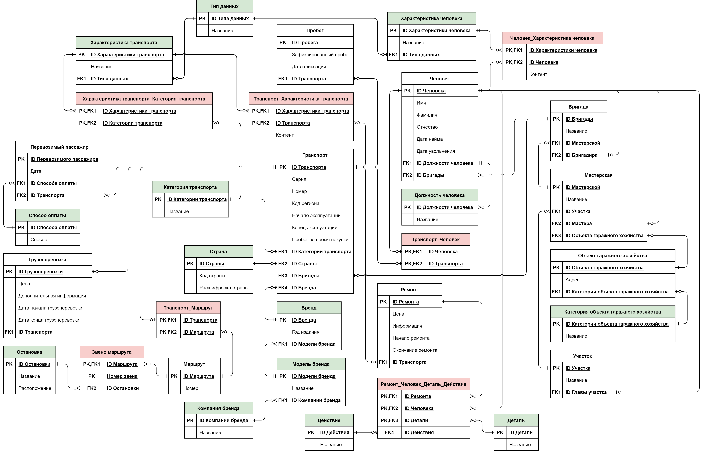
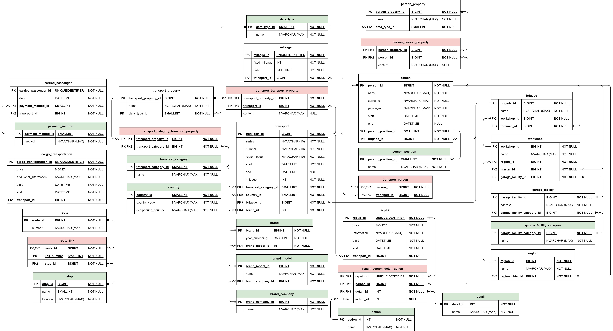
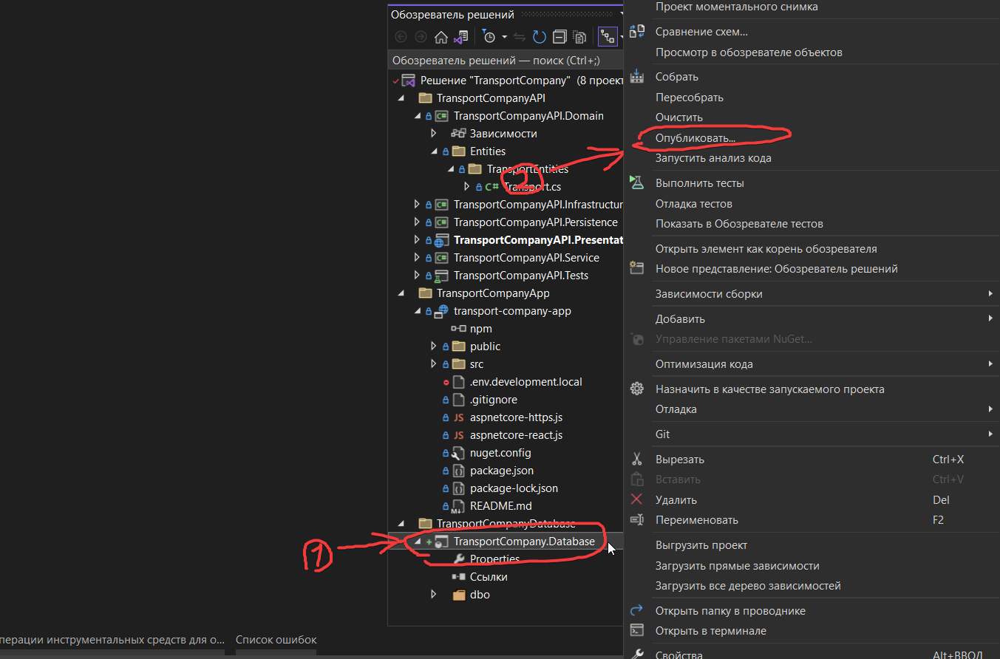
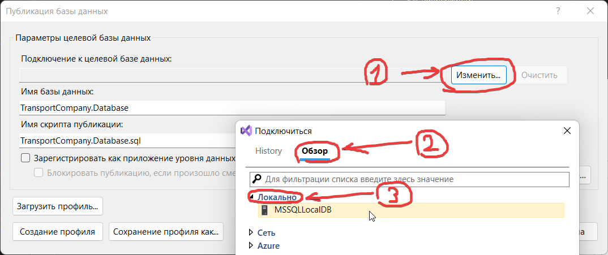
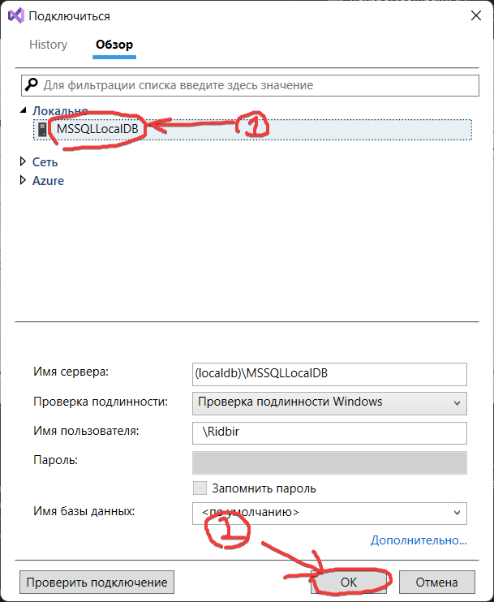
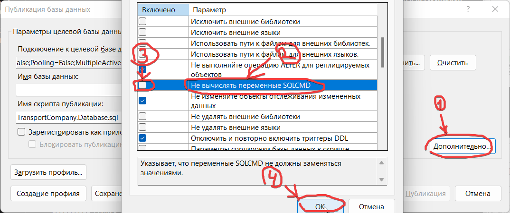
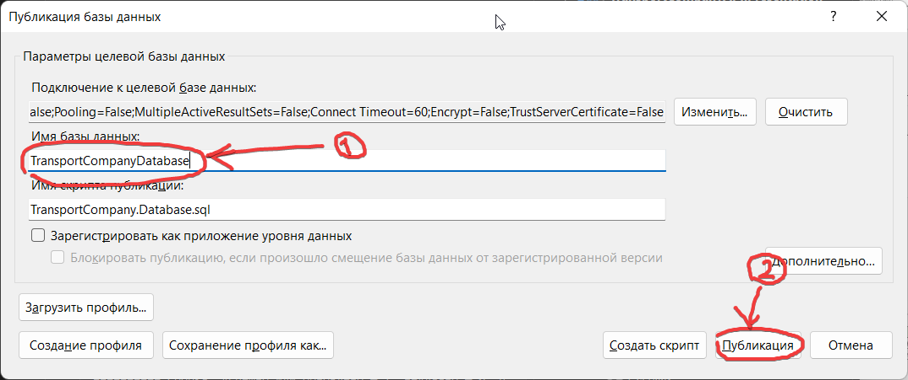
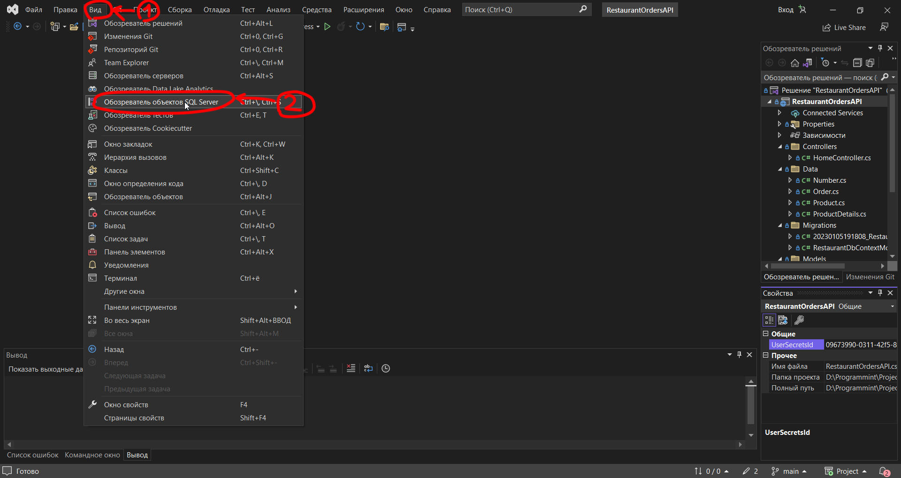
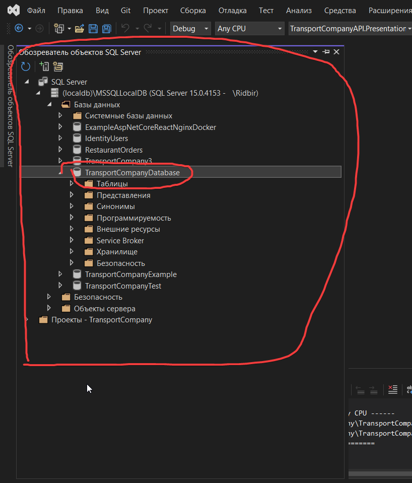

# Транспортная компания

* [О проекте](#AboutProject)
  * [Текст задания](#TaskText)
  * [Что умеет](#WhatCan)
* [Используемые технологии](#TechnologiesUsed)
  * [Версии продуктов](#ProductVersions)
  * [Клиентская часть](#ClientSide)
  * [Серверная часть](#ServerSide)
  * [База данных](#DataBase)
* [Настройка окружения разработки](#SettingDevelopmentEnvironment)
  * [Загрузка проекта](#LoadProject)
  * [Настройка Visual Studio](#VisualStudioSetup)
  * [Подключение базы данных (не обязательно)](#DatabaseConnection)

## О проекте

### Текст задания
Информационная система автотранспортного предприятия города.

Автотранспортное предприятие города занимается организацией пассажирских и грузовых перевозок внутри города. В ведении предприятия находится автотранспорт различного назначения: автобусы, такси, маршрутные такси, прочий легковой транспорт, грузовой транспорт, вспомогательный автотранспорт, представленный различными марками. Каждая из перечисленных категорий транспорта имеет характеристики, свойственные только этой категории: например, к характеристикам только грузового транспорта относится грузоподъемность, пассажирский транспорт характеризуется вместимостью и т.д. С течением времени, с одной стороны, транспорт стареет и списывается (возможно, продается), а с другой – предприятие пополняется новым автотранспортом.

Предприятие имеет штат водителей, закрепленных за автомобилями (за одним автомобилем может быть закреплено более одного водителя). Обслуживающий персонал (техники, сварщики, слесари и др.) занимается техническим обслуживанием автомобильной техники, при этом различные вышеперечисленные категории также могут иметь уникальные для данной категории атрибуты. Обслуживающий персонал и водители объединяются в бригады, которыми руководят бригадиры, далее следуют мастера, затем начальники участков и цехов. В ведении предприятия находятся объекты гаражного хозяйства (цеха, гаражи, боксы и пр.), где содержится и ремонтируется автомобильная техника.
	
Пассажирский автотранспорт (автобусы, маршрутные такси) перевозит пассажиров по определенным маршрутам, за каждым из них закреплены отдельные единицы автотранспорта. Ведется учет числа перевозимых пассажиров, на основании чего производится перераспределение транспорта с одного маршрута на другой. Учитывается также пробег, число ремонтов и затраты на ремонт по всему автотранспорту, объем грузоперевозок для грузового транспорта, интенсивность использования транспорта вспомогательного назначения. Учитывается интенсивность работы бригад по ремонту (число ремонтов, объем выполненных работ), число замененных и отремонтированных узлов и агрегатов (двигателей, мостов, шасси и т.д.) по каждой автомашине и суммарно по участку, цеху, предприятию.
Запросы в информационной системе:

1. Получите данные об автопарке предприятия.  
2. Получите перечень и общее число водителей по предприятию, по указанной автомашине. 
3. Получите распределение водителей по автомобилям. 
4. Получите данные о распределении пассажирского автотранспорта по маршрутам. 
5. Получите сведения о пробеге автотранспорта определенной категории или конкретной автомашины за указанный день, месяц, год. 
6. Получите данные о числе ремонтов и их стоимости для автотранспорта определенной категории, отдельной марки автотранспорта или указанной автомашины за указанный период. 
7. Получите данные о подчиненности персонала: рабочие – бригадиры – мастера – начальники участков и цехов. 
8. Получите сведения о наличии гаражного хозяйства в целом и по каждой категории транспорта. 
9.  Получите сведения о грузоперевозках, выполненных указанной автомашиной за обозначенный период. 
10. Получите данные о числе использованных для ремонта указанных узлов и агрегатов для транспорта определенной категории, отдельной марки автотранспорта или конкретной автомашины за указанный период. 
11. Получите сведения о купленной и списанной технике за указанный период. 
12. Получите состав подчиненных указанного бригадира, мастера. 
13. Получите данные о работах, выполненных указанным специалистом (сварщиком, слесарем и т.д.) за обозначенный период в целом и по конкретной автомашине. 

### Что умеет
...

## Используемые технологии

### Версии продуктов
* Visual Studio 2022 17.4.3
* .NET 7.0
* Node JS v18.12.1
* React 18.2.0
* Windows 11 Версия 21H2

### Клиентская часть
Сторона клиента разрабатывается при помощи JavaScript-библиотеки React. Проект создан при помощи шаблона "Автономный проект JavaScript React" в Visual Studio. Название проекта **transport-company-app**.

### Серверная часть
В API приложения используется "Луковая" архитектура (Onion Architecture). Для реализации были созданны следующие проекты-слои  
1. **TransportCompanyAPI.Domain** - сущностями. Проект содержит классы моделей, которые используются в приложении и интерфейсы реподиториев (классов для доступа к базе данных). Создан при помощи шаблона "Библиотека классов (Майкрософт)" в Visual Studio.   
2. **TransportCompanyAPI.Persistence** - обращение к базе данных. Проект содержит контексты, миграции и репозитории для доступа к базе данных. Создан при помощи шаблона "Библиотека классов (Майкрософт)" в Visual Studio.   
3. **TransportCompanyAPI.Service** - обработка данных. Проект содержит действия, выполняемые над данными, и обработку исключений. Создан при помощи шаблона "Библиотека классов (Майкрософт)" в Visual Studio.   
4. **TransportCompanyAPI.Infrastructure** - инфраструктура. Проект содержит конфигурации и вью модели (View Model) для отправки запросов. Создан при помощи шаблона "Библиотека классов (Майкрософт)" в Visual Studio.   
**TransportCompanyAPI.Persistence** - маршрутизация. Проект содержит контроллеры для создания конечных точке приложения (get и post) для обращения к API. Создан при помощи шаблона "Веб-API ASP.NET Core (Майкрософт)" в Visual Studio.  
**TransportCompanyAPI.Tests** - тестирование. Проект содержит тесты всех слоев API приложения. Создан при помощи шаблона "Тестовый проект xUnit" в Visual Studio.   

### База данных часть
Так как проект имеет большой размер, а база данных вклчает в себя около 30 таблиц, было принято решение о разработке модели базы данных. В начале была построена логическая [[рисунок 1](#LogicalModel)], а затем физическая [[рисунок 2](#PhysicalModel)] модель. Зеленым цветом отмечены справочники в которых хранится повторяющаяся информация, а красным цветом отмечены таблицы, которые служат для создание связи многие ко многим.

  

  

  <b>Рисунок 1. Логическая модель базы данных</b>

  

Логическая модель демонстрирует содержимое таблиц, а также связи между ними.

  

  

  <b>Рисунок 2. Физическая модель базы данных</b>

  

Физическая модель показывает все детали, которые необходимы для построения базы данных, а именно название таблиц и столбцов, типы данных и допустимость значения Null.  
Для хранения SQL скриптов был создан проект **TransportCompany.Database**. Создан при помощи шаблона "Проект базы данных SQL Servert" в Visual Studio. 

## Настройка окружения разработки

### Загрузка проекта
...  

### Настройка Visual Studio
...  

### Подключение базы данных
В приложении используется база данных. Ее нужно создать по скриптам из проекта TransportCompany.Database.  
1. Откройте приложение в Visual Studio
2. Нажмите правой кнопкой мыши на проект TransportCompany.Database
3. В открывшемся меню выберите "Опубликовать..."  
  

4. В открывшемся окне нажмите на кнопку "Изменить"
5. В новом окне нажмите на "Обзор" 
6. Нажмите на "Локально"  
  

7. Выберите "MSSQLLocalDB"
8. Нажмите на кнопку "Ок"  
  

9. После этого нажмите на кнопку "Дополнительно..."
10. В открывшемся окне, в разделе "Дополнительные параметры развертывания", найдите пункт "Не вычислять переменные SQLCMD"
11. В этом пункте уберите галочку
12.  Нажмите на кнопку "Ок"  
  

13.  Измените название базы данных на "TransportCompanyDatabase"
14.  Нажмите на кнопку "Публикация"  
  

15. Дождитесь пока будет создана база данных, это может занять несколько минут
16. После создания базы данных, в меню сверху, нажмите на кнопку "Вид"
17. В открывшемся меню, нажмите на кнопку "Обозреватель объектов SQL Server"  
  

18.  В "Обозревателе объектов SQL Server" перейдите по пути "SQL Server(localdb)\MSSQLLocalDB\Базы данных"  
  

Если все сделано верно, то после проделанных действий в "Обозревателе объектов SQL Server" вы увидите созданную базу данных "TransportCompanyDatabase". В ней должны лежать таблицы, функции и процедуры. Созданная база данных будет пустой. Ее необходимо заполнить вручную или при помощи приложения. 