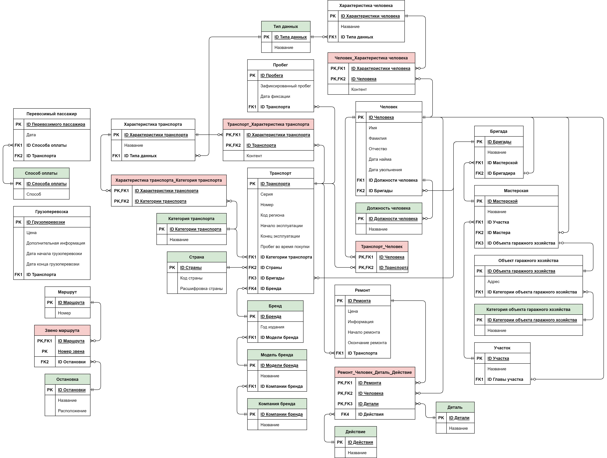

# Транспортная компания

* [О проекте](#AboutProject)
  * [Что умеет](#WhatCan)
* [Используемые технологии](#TechnologiesUsed)
  * [Версии продуктов](#ProductVersions)
  * [Клиентская часть](#ClientSide)
  * [Серверная часть](#ServerSide)
  * [База данных](#DataBase)
* [Настройка окружения разработки](#SettingDevelopmentEnvironment)
  * [Загрузка проекта](#LoadProject)

## О проекте

### Что умеет
...

## Используемые технологии

### Версии продуктов
* Visual Studio 2022 17.4.3
* .NET 7.0
* Node JS v18.12.1
* React 18.2.0
* Windows 11 Версия 21H2

### Клиентская часть
Сторона клиента разрабатывается при помощи JavaScript-библиотеки React. Проект создан при помощи шаблона "Автономный проект JavaScript React" в Visual Studio. Название проекта **transport-company-app**.

### Серверная часть
В API приложения используется "Луковая" архитектура (Onion Architecture). Для реализации были созданны следующие проекты-слои  
1. **TransportCompanyAPI.Domain** - сущностями. Проект содержит классы моделей, которые используются в приложении и интерфейсы реподиториев (классов для доступа к базе данных). Создан при помощи шаблона "Библиотека классов (Майкрософт)" в Visual Studio.   
2. **TransportCompanyAPI.Persistence** - обращение к базе данных. Проект содержит контексты, миграции и репозитории для доступа к базе данных. Создан при помощи шаблона "Библиотека классов (Майкрософт)" в Visual Studio.   
3. **TransportCompanyAPI.Service** - обработка данных. Проект содержит действия, выполняемые над данными, и обработку исключений. Создан при помощи шаблона "Библиотека классов (Майкрософт)" в Visual Studio.   
4. **TransportCompanyAPI.Infrastructure** - инфраструктура. Проект содержит конфигурации и вью модели (View Model) для отправки запросов. Создан при помощи шаблона "Библиотека классов (Майкрософт)" в Visual Studio.   
**TransportCompanyAPI.Persistence** - маршрутизация. Проект содержит контроллеры для создания конечных точке приложения (get и post) для обращения к API. Создан при помощи шаблона "Веб-API ASP.NET Core (Майкрософт)" в Visual Studio.  
**TransportCompanyAPI.Tests** - тестирование. Проект содержит тесты всех слоев API приложения. Создан при помощи шаблона "Тестовый проект xUnit" в Visual Studio.   

### База данных часть
Так как проект имеет большой размер, а база данных вклчает в себя около 30 таблиц, было принято решение о разработке модели базы данных. В начале была построена логическая [[рисунок 1](#LogicalModel)], а затем физическая [[рисунок 2](#PhysicalModel)] модель. Зеленым цветом отмечены справочники в которых ранится повторяющаяся информация, а красным цветом отмечены таблицы, которые служат для создание связи многие ко многим.

  

  

  <b>Рисунок 1. Логическая модель базы данных</b>

  

Логическая модель демонстрирует содержимое таблиц, а также связи между ними.

  

  

  <b>Рисунок 2. Физическая модель базы данных</b>

  

Физическая модель показывает все детали, которые необходимы для построения базы данных, а именно название таблиц и столбцов, типы данных и допустимость значения Null.

## Настройка окружения разработки

### Загрузка проекта

...